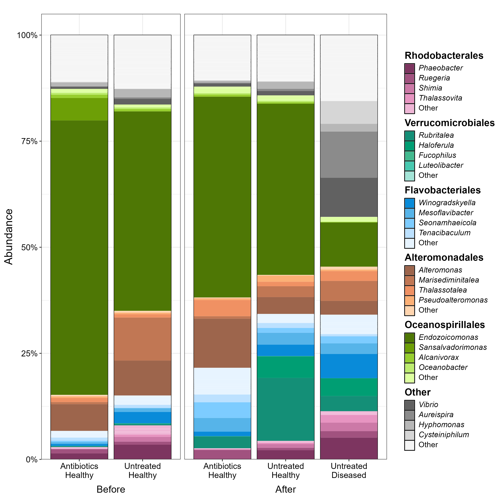
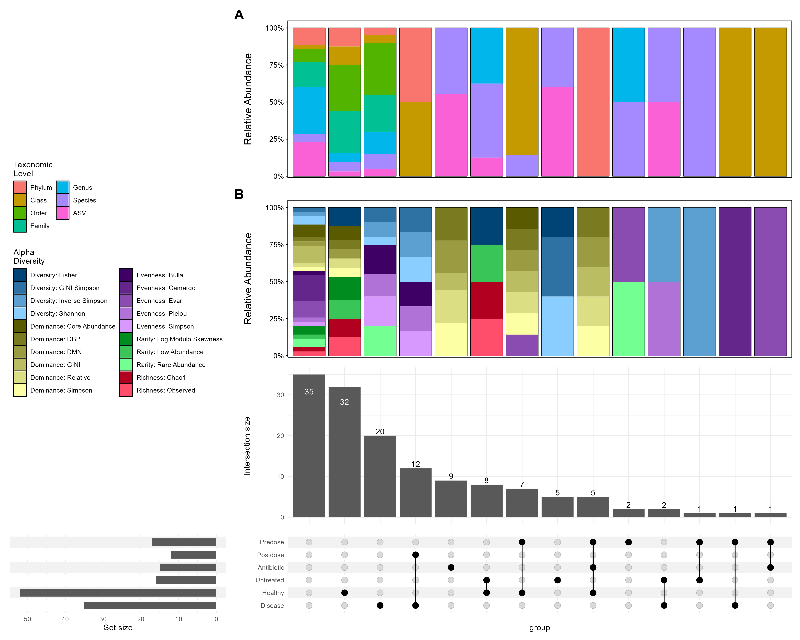
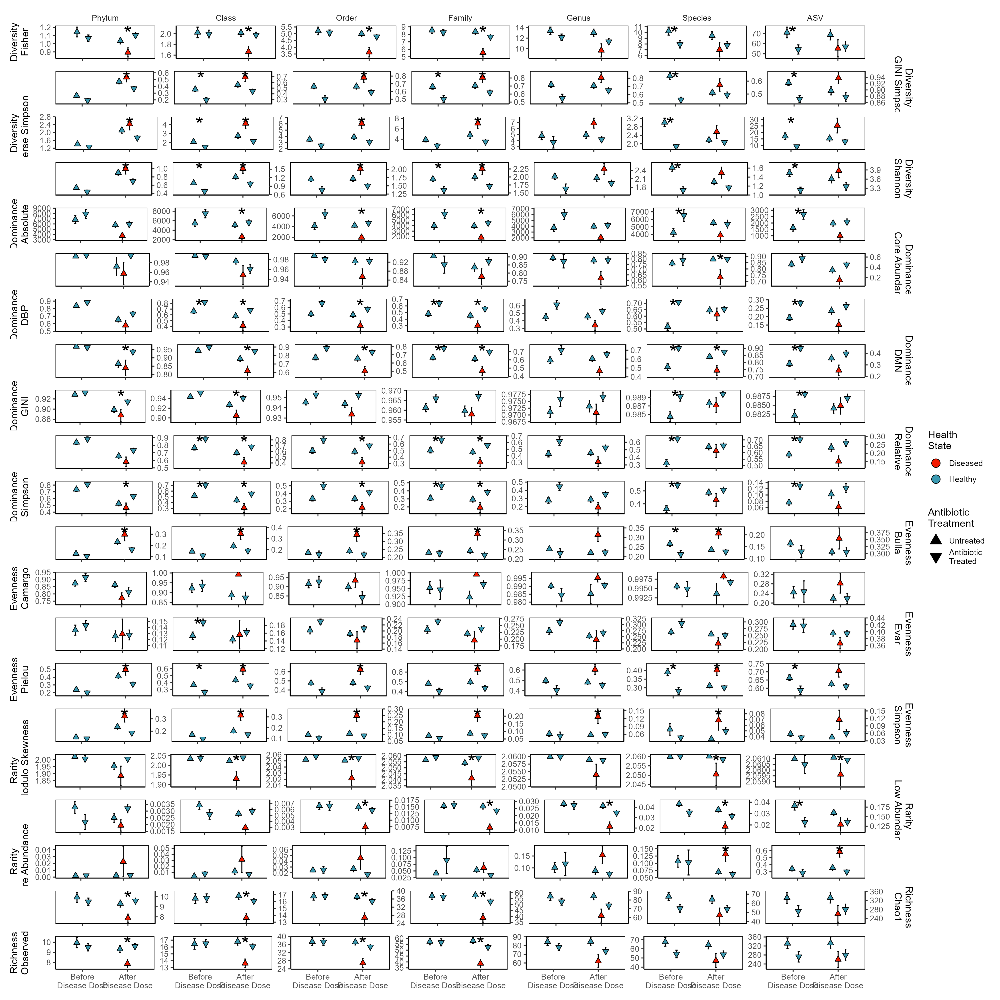
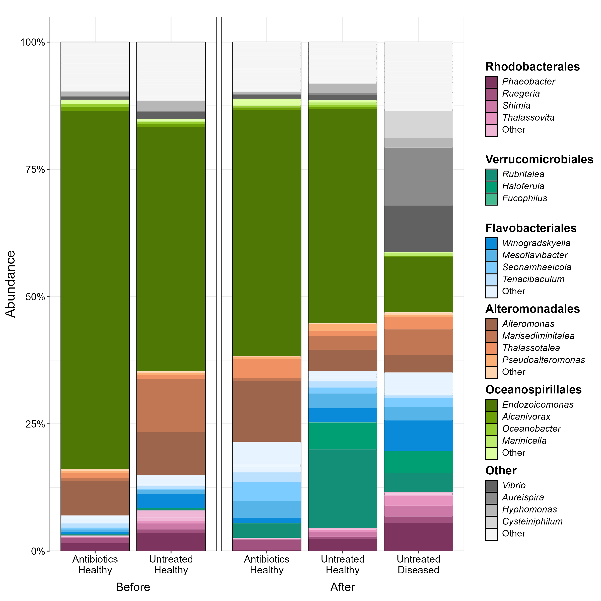
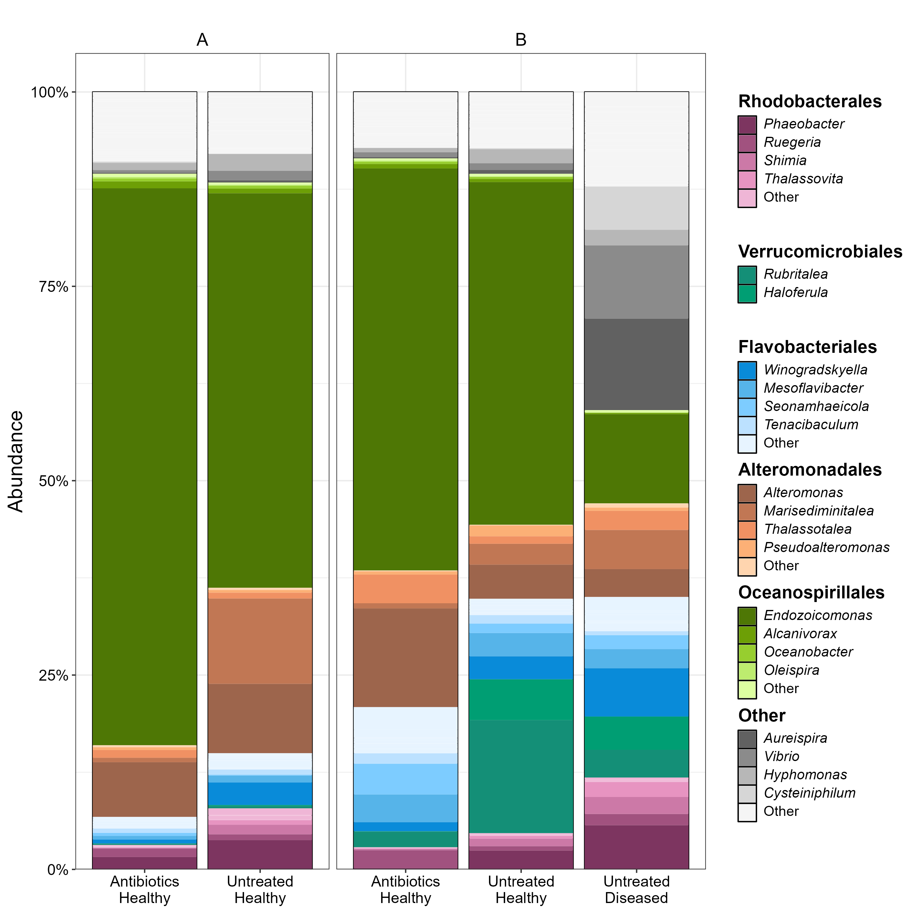
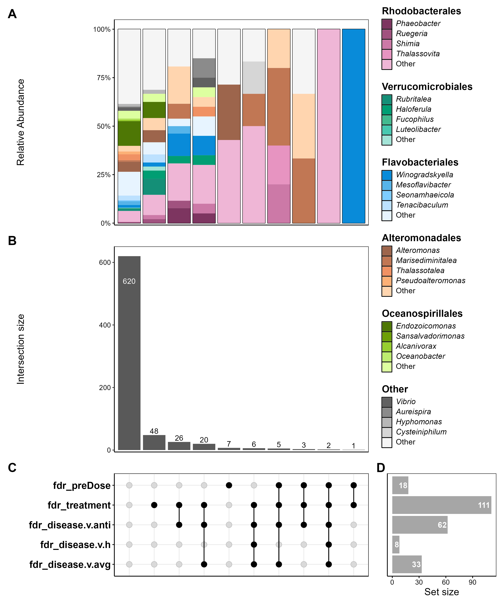
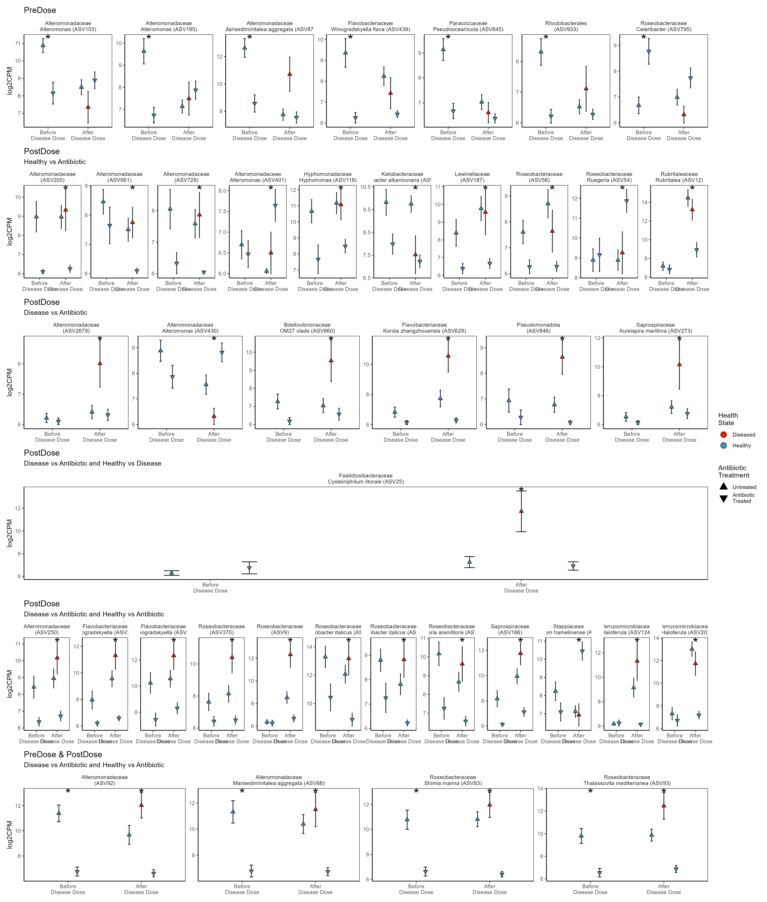

# Panama_Antibiotics

These samples are composed of 3,815 unique ASVs representing 41 classes, 95 orders, 194 families, and 387 genera.

We analyzed the alpha diversity and how it changes across treatments across all taxonomic levels from ASVs up through microbial Class. The alpha diversity metrics cover all commonly used metrics across a range of alpha diversity measures including richness (observed and chao1), diversity (Fisher, Gini-Simpson, inverse Simpson, and Shannon-Weiner), evenness (Bulla, Camargo, Evar, Pielou, Simpson), dominance (core abundance, DBP, DMN, Gini, Relative, Simpson), and rarity (log modulo skewness, low abundance, rare abundance). We find significant differences in which taxonomic levels occur across significance groupings (𝜒2(18) = 118.5, *p* < 0.00001) as well as which alpha metric major categories occur across significance groupings (𝜒2(12) = 27.3, *p* = 0.00701) and the interaction between taxonomic levels and alpha diversity metric class (𝜒2(102) = 244.6, *p* < 0.00001).

After removal of ASVs due to rarity (present in <10% of samples) 787 unique ASVs remained representing 21 classes, 54 orders, 87 families, and 155 genera.

We find that before introducing the disease homogenate the microbial community significantly differs based on treatment with the antibiotic (r2 = 0.06, *F*(1,32) = 2.15, *p* = 0.0058) likely due to the substantially different dispersions (*F*(1,32) = 4.76, *p* = 0.037). After dosing with the disease homogenate the combination of disease outcome and prior antibiotic treatment significantly influences the microbial community (r2 = 0.09, *F*(2,62) = 3.08, *p* < 0.0001) without having substantially different dispersions (*F*(2,62) = 1.52, *p* = 0.22). Indicating the observed differences are driven by primary differences in microbial composition not as a result of changes in the variation within groupings.

Prior to the analysis of individual ASVs, ASVs which were invariant in one or more of the sampling times/treatments were removed leaving 392 ASVs across 18 classes, 48 orders, 70 families, and 112 genera.

The vast majority (352) of all retained ASVs show no difference between the initial antibiotic dosed and undosed treatments (`predose_fdr`) nor among any of the post disease exposure treatment combinations (`postdose_fdr`) including the healthy outcome antibiotic treated, healthy outcome not antibiotic treated, and disease outcome not antibiotic treatment. The remaining 40 ASVs were significant (after FDR correction) for either predose differences (7), post-dose differences (29) or both (4). Showing no significant associations between any taxonomic level and the significance groupings (all *p* > 0.7).

We used pairwise post-hoc tests on the post-dose treatments to group ASVs together. We find that all of the ASVs which significantly differ before and after the dose (4) fall into the post-dose categories of having significantly different disease and healthy outcomes compared to the antibiotic dosed samples. This is also the most abundant group among the only post-dose significant ASVs (12). The second most represented group (10) shows significant differences between healthy outcomes and those dosed with the antibiotic. In most (though not all see ASV401, ASV441 & ASV54) this is likely due to the relatively small number of samples which developed disease symptoms leading to greater uncertainty estimating the amount of ASVs in the disease outcome. The next most abundant group are the ASVs only significantly affected in the predose treatment which are generally more abundant in the untreated than the antibiotic treated tanks (except ASV795). The next most abundant are ASVs which differ after the dose between the disease outcome and the antibiotic treated. These have two broad classes one where there is far less of the ASV in the disease outcome samples than those treated with antibiotics (ASV430) and all the others where the ASV is more abundant in the disease outcome samples. The final class of ASV shows significant post-dose differences between the disease and antibiotic and between the healthy and disease samples. The only ASV falling into this category is ASV25 (*Cysteiniphilum litorale*) the putative pathogen.

Complete ASV results are [here](Results/individual_asv_results.csv)
